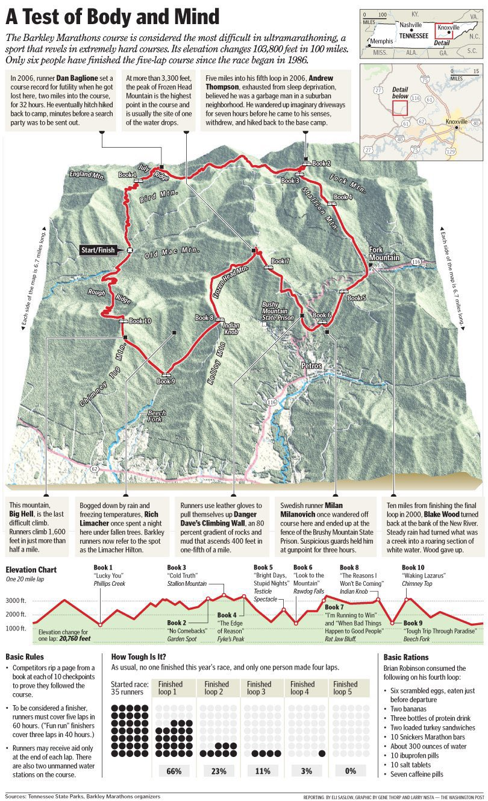

# barkley_plots

just some quick scripts I wrote to make sense of Keith's tweets from the Barkley Marathons. 

Most of the nitty-gritty work comes from maintaining the CSV files. I should probably find a way to mine Keith's tweets so I don't have to maintain the CSV (though, the tweets aren't perfect and have some typos, so there would need to be some sort of manual component anyway)

Next year, instead of re-rendering the plots every few minutes, I'll probably just build a shiny dashboard that updates whenever I update the CSV.

